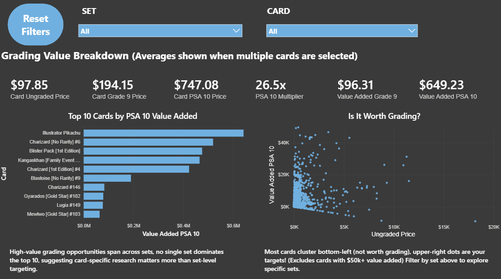

# Pokémon Card Market Analysis

## Overview
A Python web scraper that collects 30,000+ Pokémon card prices across 325 sets 
from [PriceCharting.com](https://www.pricecharting.com). Data is saved to a CSV 
file and analyzed using SQL to uncover market trends and grading ROI insights.

## Key Findings

1. 3864 cards (around 10%) in the dataset add $500+ in value when graded as a PSA 10. 
2. High-value grading opportunities are spread across sets. No single set dominates the top 10, making card-specific research more important than set-level targeting.
3. The average PSA 10 multiplier across reliable data is 25.31x (PSA 10 multiplier = PSA 10 price divided by ungraded price).
4. Cards in the $50–$100 ungraded price range offer the best balance of grading ROI, averaging a 20x PSA 10 multiplier and $1,380 in value added, making them the most accessible high-return grading targets.

## Motivation

The Pokemon card market is a multi-billion dollar collectibles market where prices are driven by card condition, rarity, and grading. Professional grading (PSA, BGS) can multiply a card's value significantly but not all cards are worth grading. This project answers the question: which cards are actually worth getting graded, and by how much?

## Data Source

All data was self-scraped from **PriceCharting.com** (no Kaggle datasets were used).

PriceCharting aggregates real transaction data from eBay sold listings and other marketplaces, providing:

- Ungraded market prices
- Grade 9 prices
- PSA 10 prices (highest achievable grade)
- Coverage across hundreds of Pokemon sets

Data was scraped using Python (see [`scraper.py`](scraper.py) for the full scraping code) saved to a CSV file, and then loaded into Microsoft SQL Server for analysis.

## Tools & Tech Stack
 
| Tool | Purpose |
|---|---|
| Python (httpx, selectolax) | Web scraping |
| Microsoft SQL Server | Data storage and analysis |
| Power BI | Dashboard and visualization |

## Dashboard Preview

## How It Works
 
### 1. Data Collection (Python)
The scraper navigates to PriceCharting's Pokemon category page, identifies all available sets, then loops through each set page extracting card names and prices across three grading tiers: ungraded, Grade 9, and PSA 10. A one-second delay between requests avoids overloading the server. Results are saved to a CSV file tagged with the scrape date.
 
### 2. Data Storage (SQL Server)
The CSV is loaded into Microsoft SQL Server where all analysis is performed. Sealed products (boxes, packs) are excluded from all queries since they behave differently from individual cards.
 
### 3. Analysis (SQL)
Six queries drive the core analysis:
 
- **Total cards in dataset** — baseline count of scraped records
- **Top 10 most expensive ungraded cards** — market overview of highest value cards
- **Grading ROI with outlier flag** — PSA 10 multiplier per card, with a statistical flag for unreliable data points
- **Reliable grading opportunities** — same analysis filtered to trustworthy data only
- **Cards where grading adds $500+ in value** — high-impact grading targets
- **Average value added by grading** — market-wide benchmark for grading ROI
- **Price bucket ROI analysis** — average multiplier and value added by ungraded price range to identify the optimal grading entry point.

### 4. Outlier Handling
Since the dataset does not include sales volume, cards with very few transactions can show extreme price multipliers that don't reflect true market value. To handle this, a statistical outlier flag was built into the grading ROI query: any card with a PSA 10 multiplier more than 10x the dataset average is flagged as "Outlier - Verify Manually" and excluded from the reliable opportunities analysis.
 
### 5. Dashboard (Power BI)
The Power BI dashboard provides an interactive view of the dataset with filters by set and card name. A reset all filters button sits at the top for easy navigation.

The dashboard is included as a .pbit (Power BI template) file. This format excludes the raw data to keep the file lightweight. To use it, open the file in Power BI Desktop and load pokemon_prices.csv when prompted.
 
### What I Learned
 
- End-to-end data pipeline construction: scraping, storage, analysis, and visualization
- Handling data quality issues without sales volume data by using statistical outlier detection
- Translating a real-world collectibles market into a structured analytics problem with business-relevant insights

## Future Improvements
 
- Add a Python collection valuation script: input your cards via CSV, output current value and grading recommendations

